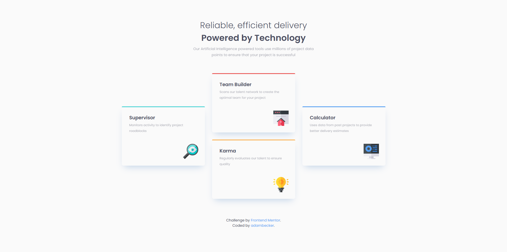

# Frontend Mentor - Four Card Feature Section

## Table of contents

- [Overview](#overview)
  - [The challenge](#the-challenge)
  - [Screenshot](#screenshot)
  - [Links](#links)
- [My process](#my-process)
  - [Built with](#built-with)
  - [What I learned](#what-i-learned)
  - [Continued development](#continued-development)
  - [Useful resources](#useful-resources)
- [Author](#author)

---

## Overview

### The challenge

The goal of this project was to build a responsive four-card feature section that matches the provided design as closely as possible. It required accurate implementation of both layout and styles, as well as ensuring accessibility and responsiveness.

**Users should be able to:**
- View the optimal layout for the section depending on their device's screen size.
- Navigate the website efficiently with proper accessibility features.
- Enjoy a visually appealing and responsive design.

---

### Screenshot

---

### Links

- **Solution URL**: [GitHub Repository](https://github.com/adambeckercodes/fem-four-card-feature-section)
- **Live Site URL**: [Live Demo](https://fem-four-card-feature-section-jet.vercel.app/?vercelToolbarCode=F026-kMx-qIqECh)

---

## My process

### Built with

- Semantic HTML5 markup
- CSS Grid and Flexbox for layout
- Mobile-first workflow
- CSS custom properties for consistent styling

---

### What I learned

This project helped reinforce:
**CSS Flexbox vs Grid**: Improved my ability to choose the right layout tool depending on the design needs.

---

### Continued development

- Enhance accessibility further with keyboard navigation for interactive elements.
- Implement animations for hover effects and transitions to improve the user experience.
- Explore using modern image formats (like WebP) for better performance.
- Improve my CSS Grid Skills to be able to build more complex layouts

---

### Useful resources

- [MDN Web Docs - CSS Grid](https://developer.mozilla.org/en-US/docs/Web/CSS/CSS_Grid_Layout) - Helped in designing the responsive grid structure.
- [A11y Project](https://www.a11yproject.com/) - A great resource for improving accessibility.
- [CSS Tricks - Flexbox Guide](https://css-tricks.com/snippets/css/a-guide-to-flexbox/) - Clarified the differences between Grid and Flexbox.

---

## Author

- **Frontend Mentor**: [Profile](https://www.frontendmentor.io/profile/adambeckercodes)
- **GitHub**: [Profile](https://github.com/adambeckercodes)
- **Twitter**: [Profile](https://x.com/adambeckercodes)